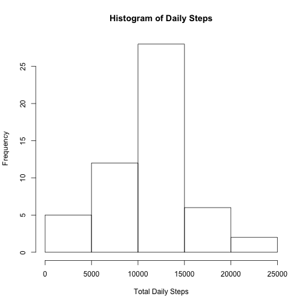
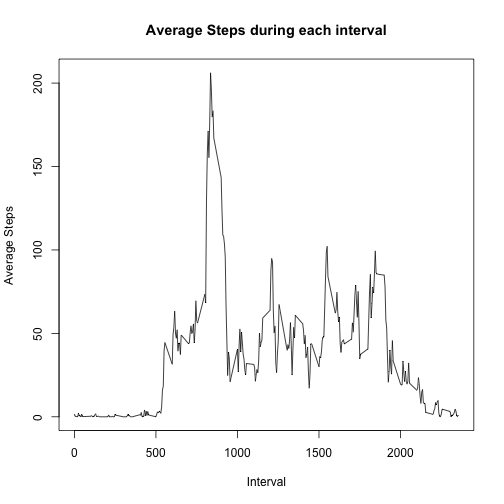
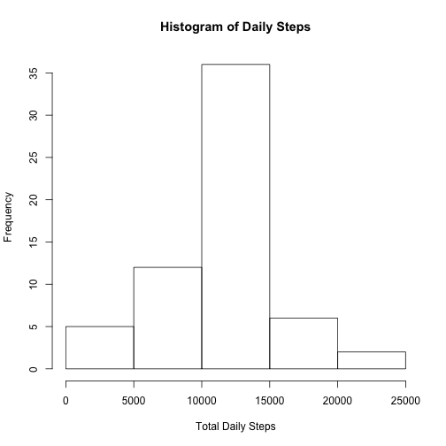
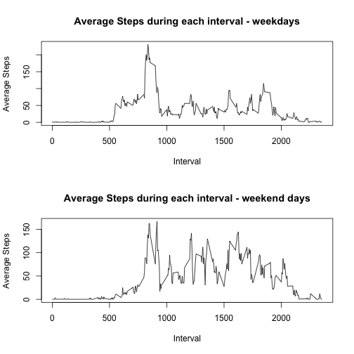

# Activity Monitor Data Analysis

## Introduction

It is now possible to collect a large amount of data about personal movement using activity monitoring devices such as a Fitbit, Nike Fuelband, or Jawbone Up. These type of devices are part of the “quantified self” movement – a group of enthusiasts who take measurements about themselves regularly to improve their health, to find patterns in their behavior, or because they are tech geeks. But these data remain under-utilized both because the raw data are hard to obtain and there is a lack of statistical methods and software for processing and interpreting the data. 

This data is from a personal activity monitoring device. This device collects data at 5 minute intervals through out the day. The data consists of two months of data from an anonymous individual collected during the months of October and November, 2012 and include the number of steps taken in 5 minute intervals each day.


##Dataset : Activity monitoring data [52K]

The variables included in this dataset are:

**steps** : Number of steps taking in a 5-minute interval (missing values are coded as 𝙽𝙰)  
**date** : The date on which the measurement was taken in YYYY-MM-DD format  
**interval** : Identifier for the 5-minute interval in which measurement was taken  

## Part 1 : Load Data


```r
tempf <- tempfile()
download.file("https://d396qusza40orc.cloudfront.net/repdata%2Fdata%2Factivity.zip",tempf, mode="wb")
unzip(tempf, "activity.csv")
df_activity <- read.csv('activity.csv', header = TRUE) 
```

## Part 2 :  Total Daily Steps analysis
### 2.1 Total No. of steps taken per day  


```r
df_total_steps_daily <- aggregate(data = df_activity[,c('date', 'steps')], steps ~ date, FUN = sum, na.action = na.omit)
```

### 2.2 Total Daily steps histogram


```r
hist(df_total_steps_daily$steps, main = "Histogram of Daily Steps", xlab = 'Total Daily Steps')
```




### 2.3 Mean, Median of total daily steps


```r
summary(df_total_steps_daily)
```

```
##          date        steps      
##  2012-10-02: 1   Min.   :   41  
##  2012-10-03: 1   1st Qu.: 8841  
##  2012-10-04: 1   Median :10765  
##  2012-10-05: 1   Mean   :10766  
##  2012-10-06: 1   3rd Qu.:13294  
##  2012-10-07: 1   Max.   :21194  
##  (Other)   :47
```


## Part 3 average daily activity pattern

### 3.1 Interval means across days


```r
df_interval_averages <- aggregate(data = df_activity[,c('interval', 'steps')], steps ~ interval, FUN = mean, na.action = na.omit)
plot(df_interval_averages$interval, df_interval_averages$steps, main = 'Average Steps during each interval', xlab = 'Interval', ylab = 'Average Steps', type = 'l')
```



### 3.2 Interval containing maximum steps (averaged across all days)


```r
df_interval_averages$interval[df_interval_averages$steps == max(df_interval_averages$steps)]
```

```
## [1] 835
```

The 5 minute interval 8:35 to 8:40 on an average contains maximum number of steps

## Part 3 Imputing Missing Values

### 3.1 Number of rows with missingvalues


```r
dim(df_activity[is.na(df_activity$steps),])
```

```
## [1] 2304    3
```
There are 2304 rows with missing values

### 3.2, 3.3 Filling missing values into a new dataframe


```r
df_imputed <- df_activity
df_imputed$steps[is.na(df_imputed$steps)] <- with(df_imputed, ave(steps, interval, FUN = function(x) mean(x, na.rm = TRUE)))[is.na(df_imputed$steps)]
```

### 3.4 Histogram of imputed dataset


```r
df_total_steps_daily <- aggregate(data = df_imputed[,c('date', 'steps')], steps ~ date, FUN = sum)
hist(df_total_steps_daily$steps, main = "Histogram of Daily Steps", xlab = 'Total Daily Steps')
```


  
  
Comparing the histogram of imputed dataset with the histogram which omits missing values, It is observed that there is no discernible impact.

## Part 4 Activity Patterns During Weekdays vs Weekends  


```r
df_imputed$day <- as.factor(ifelse(weekdays(as.Date(df_imputed$date)) %in% c('Saturday', 'Sunday'), 'weekend', 'weekday'))

df_weekdays <- df_imputed[df_imputed$day == 'weekday',]
df_weekend <- df_imputed[df_imputed$day == 'weekend',]

df_weekday_av <- aggregate(data = df_weekdays[, c('interval', 'steps')], steps ~ interval, FUN = mean)
df_weekend_av <- aggregate(data = df_weekend[, c('interval', 'steps')], steps ~ interval, FUN = mean)

par(mfrow = c(2,1))
plot(df_weekday_av$interval, df_weekday_av$steps, main = 'Average Steps during each interval - weekdays', xlab = 'Interval', ylab = 'Average Steps', type = 'l')
plot(df_weekend_av$interval, df_weekend_av$steps, main = 'Average Steps during each interval - weekend days', xlab = 'Interval', ylab = 'Average Steps', type = 'l')
```


